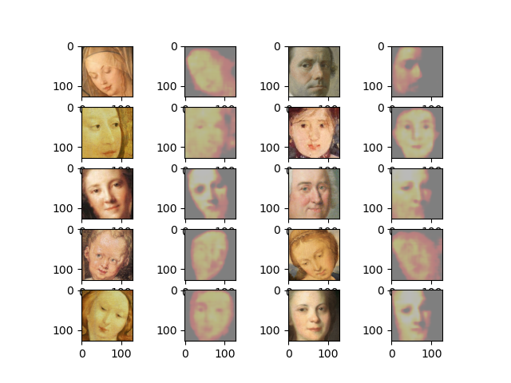
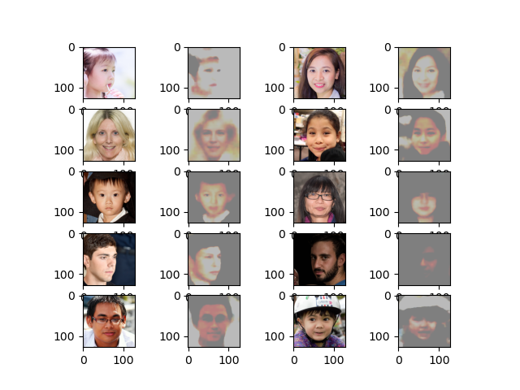

# Painter VAE

Greg Attra <br>
CS 5330 | Prof. Maxwell

----

## Overview

The Painter VAE program takes pictures of faces and paints them in the style of
Renaissance artists. Alternatively, it takes a Renaissance portrait and converts it
to a picture of a face.

## Implementation

The system is composed of two variational autoencoders (VAEs): one for encoding and decoding
Renaissance-style portraits, and another for encoding and decoding pictures of faces.

### Painting VAE

This VAE is responsible for encoding and decoding portraits in the style of Renaissance art. 

**Training**

The mdoel was trained for 30 epochs on the [following dataset](https://data.mendeley.com/datasets/289kxpnp57/1):
```
Yang, Jiaqi (2021),
“Portrait Painting Dataset For Different Movements”,
Mendeley Data,
V1,
doi: 10.17632/289kxpnp57.1

http://dx.doi.org/10.17632/289kxpnp57.1
```

Here are the final results:



The results are not very good. The colors are muted and uniform throughout each image. And
while some blurriness is to be expected with VAEs, some of the images are lacking even
basic distinguishing features such as eyes, a nose or mouth.

This is in part due to the small dataset used to train the VAE. My reasoning for this that
when training the Faces VAE, I initially used a small training set of ~1000 images and
the results were similar. When that dataset was increased to 70,000, the results were
much crisper and varied.

### Faces VAE

This VAE is responsible for encoding and decoding digital pictures of faces, typically
those used for a profile picture on a social media website.

**Training**

The model was trained for 30 epochs on the [following dataset](https://github.com/NVlabs/ffhq-dataset):
```
Flickr-Faces-HQ Dataset (FFHQ)
https://github.com/NVlabs/ffhq-dataset
```

Here are the final results:



### Painter App

*Picture-to-painting*
The Painter app puts it all together by building a new VAE from the encoder and decoder
of the faces and paintings VAEs. The encoder from the Faces VAE is used to encode the input
profile pictures. And the decoder from the Paintings VAE is used to decode that encoding
into a painting.

**Results**

I may rename this project Nightmare VAE. The results are not great, likely due to the poor performance of the Painter VAE decoder:


Despite the poor performance, there are some patterns that can be found. For example, the decoder
maintained the orientation of the face, and even the facial hair for one image.

*Painting-to-picture*

Inversely, the encoder for the Painting VAE and the decoder for the Faces VAE can be used
to convert a painting to a digital picture of a face:


These results are equally as poor as the *Picture-to-painting* VAE above. Again, my
default assumption is to attribute this to the poor performance of the Painting VAE.

## Afterthoughts

It has been well studied that GANs generate more realistic images than VAEs. They do not
suffer from blurry outputs and the discriminator network can learn complex features that make
an image appear realistic.

### Acknowledgements
* [Keras VAE tutorial](https://keras.io/examples/generative/vae/)
* [Tensorflow VAE tutorial](https://www.tensorflow.org/tutorials/generative/cvae)
* [Portrait Dataset](https://data.mendeley.com/datasets/289kxpnp57/1)
* [Faces Dataset](https://github.com/NVlabs/ffhq-dataset)
